# Crop Classification with Graph Convolutional Networks (GCN)

[](https://github.com/Osman-Geomatics93/GCN-Crop-Classification/actions/workflows/ci.yml)
[](https://www.python.org/)
[](https://pytorch.org/)
[](https://pyg.org/)
[](LICENSE)
[](https://sentinel.esa.int/web/sentinel/missions/sentinel-2)
[](https://github.com/Osman-Geomatics93/GCN-Crop-Classification)

Pixel-level crop classification from **Sentinel-2** satellite imagery using a **Graph Convolutional Network** built with PyTorch Geometric. The model classifies agricultural land into 5 crop/land-cover classes at 10 m spatial resolution.

<p align="center">
  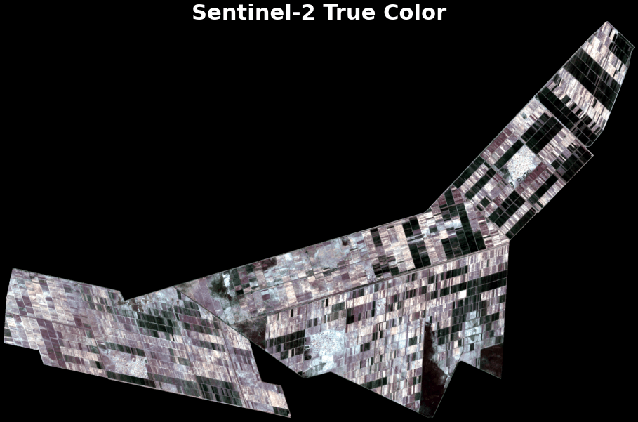
</p>

---

## Table of Contents

- [Overview](#overview)
- [Method](#method)
  - [Model Architecture](#model-architecture)
- [Project Structure](#project-structure)
- [Results](#results)
  - [Exploratory Data Analysis](#1-exploratory-data-analysis)
  - [Model Training](#2-model-training)
  - [Model Evaluation](#3-model-evaluation)
  - [Spatial Classification Map](#4-spatial-classification-map)
- [Interactive Demo](#interactive-demo)
- [Installation](#installation)
- [Usage](#usage)
- [Data](#data)
  - [Study Area](#study-area)
  - [Sentinel-2 Raster Composite](#sentinel-2-raster-composite)
  - [Training Dataset](#training-dataset)
  - [Preprocessing Pipeline](#preprocessing-pipeline)
- [License](#license)

---

## Overview

This project classifies agricultural land into **5 crop/land-cover classes** using 23 spectral and vegetation index features derived from Sentinel-2 imagery:

| Class | Description |
|:------|:------------|
| **Cotton** | Cotton crop fields |
| **Wheat** | Wheat crop fields |
| **Fallow** | Bare / fallow agricultural land |
| **Grass** | Grassland and pasture areas |
| **Water** | Rivers, canals, and water bodies |

## Method

```
Sentinel-2 Image (24 bands)
        |
        v
Feature Extraction (23 features: 10 spectral bands + 13 vegetation indices)
        |
        v
KNN Graph Construction (k=8 neighbors in feature space)
        |
        v
3-Layer GCN (128 hidden units, BatchNorm, Dropout, class-weighted loss)
        |
        v
Tiled Raster Inference (512x512 pixel tiles)
        |
        v
Classified Crop Map (GeoTIFF + PNG)
```

1. **Feature extraction** -- 10 Sentinel-2 bands (B2-B12) + 13 spectral indices (NDVI, EVI, SAVI, etc.)
2. **Graph construction** -- K-nearest neighbor graph (k=8) built in feature space to capture spectral similarity
3. **GCN training** -- 3-layer GCN with batch normalization, dropout (0.5), and inverse-frequency class weighting
4. **Raster inference** -- Tiled KNN-graph prediction over the full 2262x1424 Sentinel-2 composite

### Model Architecture

The GCN consists of 3 graph convolutional layers with batch normalization and dropout. The KNN graph (k=8) provides the edge connectivity, enabling each pixel to aggregate spectral information from its 8 most similar neighbors in feature space.

<p align="center">
  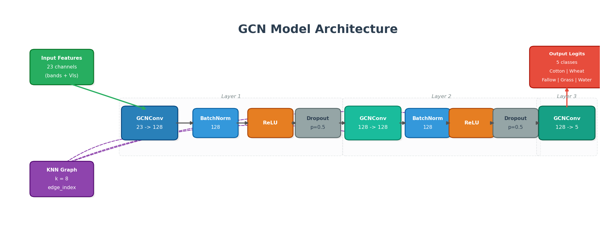
</p>

| Component | Details |
|:----------|:--------|
| **Input** | 23 features (10 spectral bands + 13 vegetation indices) |
| **Layer 1** | GCNConv(23, 128) + BatchNorm + ReLU + Dropout(0.5) |
| **Layer 2** | GCNConv(128, 128) + BatchNorm + ReLU + Dropout(0.5) |
| **Layer 3** | GCNConv(128, 5) — output logits |
| **Graph** | KNN (k=8), symmetric, undirected |
| **Parameters** | 20,741 |
| **Optimizer** | Adam (lr=0.01, weight_decay=5e-4) |
| **Loss** | CrossEntropy with inverse-frequency class weights |
| **Early stopping** | Patience = 30 epochs |

## Project Structure

```
.
|-- app.py                       # Streamlit interactive dashboard
|-- tutorial.ipynb               # Step-by-step Jupyter notebook tutorial
|-- explore_data.py              # EDA and feature visualization
|-- gcn_crop_classification.py   # GCN model training and evaluation
|-- apply_gcn_to_raster.py       # Apply trained model to full raster
|-- requirements.txt             # Python dependencies
|-- CITATION.cff                 # Citation metadata
|-- CONTRIBUTING.md              # Contribution guidelines
|-- CODE_OF_CONDUCT.md           # Community code of conduct
|-- LICENSE                      # MIT License
|-- .github/
|   |-- workflows/ci.yml         # GitHub Actions CI
|   |-- ISSUE_TEMPLATE/          # Bug report & feature request forms
|   +-- PULL_REQUEST_TEMPLATE.md # PR template
|-- data/                        # Input data (not tracked in git)
|   |-- crop_training_data_5classes_2020.csv
|   |-- S2_composite_24bands_2020_Q1.tif
|   +-- crop_classification_map.tif  (output)
+-- figures/                     # Generated plots and maps
    |-- comparison.gif           # Animated satellite vs classification
    |-- gcn_architecture.png     # Model architecture diagram
    |-- crop_classification_map.png
    |-- gcn_training_curves.png
    |-- gcn_confusion_matrix.png
    |-- gcn_confusion_matrix_norm.png
    |-- gcn_per_class_accuracy.png
    |-- gcn_tsne_embeddings.png
    +-- 01-06_*.png              # EDA visualizations
```

---

## Results

### 1. Exploratory Data Analysis

#### 1.1 Class Distribution

The training dataset contains ~24,000 labeled pixels across 5 classes. The distribution is imbalanced -- Fallow dominates at 45%, while Cotton (1.4%) and Water (0.6%) are minority classes. This imbalance is addressed during training using inverse-frequency class weighting.

<p align="center">
  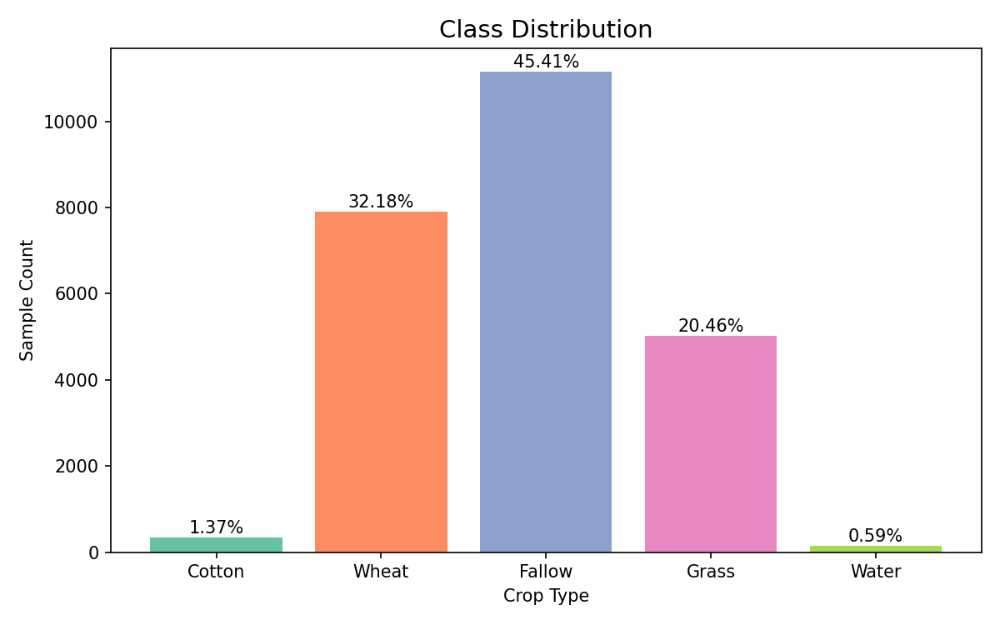
</p>

---

#### 1.2 Feature Correlation Matrix

The correlation heatmap reveals the relationships between all 23 spectral and index features. Strong positive correlations exist among vegetation indices (NDVI, EVI, SAVI, GNDVI) and among red-edge bands (B5-B7). Negative correlations appear between vegetation indices and bare-soil indicators (BSI, MNDWI), confirming their complementary roles for discrimination.

<p align="center">
  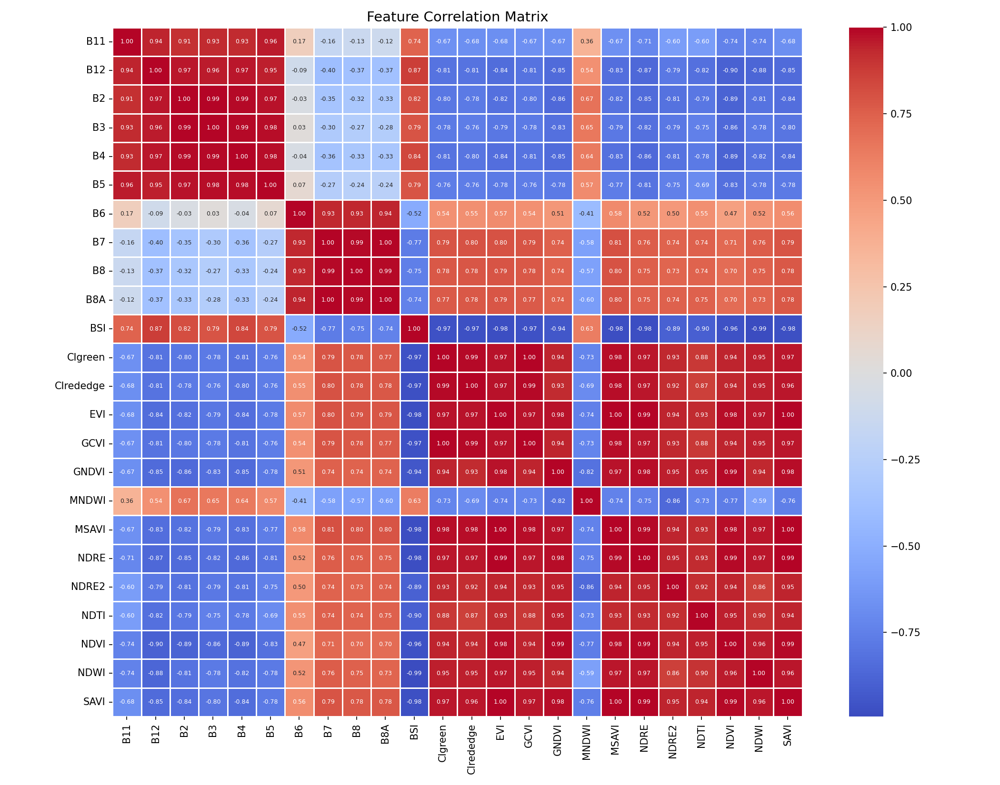
</p>

---

#### 1.3 Spectral Band Distributions per Class

Box plots of the 10 Sentinel-2 spectral bands (B2-B12) and BSI broken down by crop class. Each class exhibits a distinct spectral signature -- Wheat shows consistently high reflectance in NIR bands (B7, B8), Water has low reflectance across all bands, and Fallow is characterized by high short-wave infrared (B11, B12) values relative to NIR.

<p align="center">
  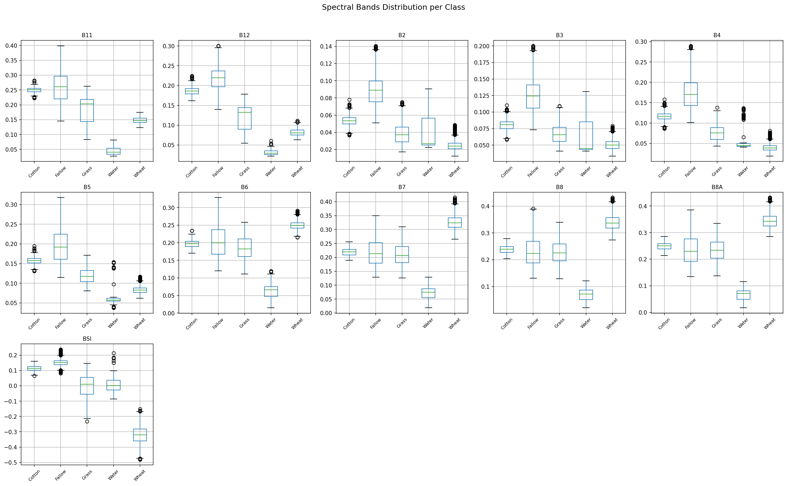
</p>

---

#### 1.4 Vegetation Index Distributions per Class

Box plots of the 13 derived vegetation indices per class. Wheat stands out with high NDVI, EVI, and SAVI values (active vegetation), while Fallow and Water cluster near zero or negative ranges. CIgreen and CIrededge provide strong separability between vegetated crops (Wheat, Grass) and non-vegetated surfaces (Fallow, Water).

<p align="center">
  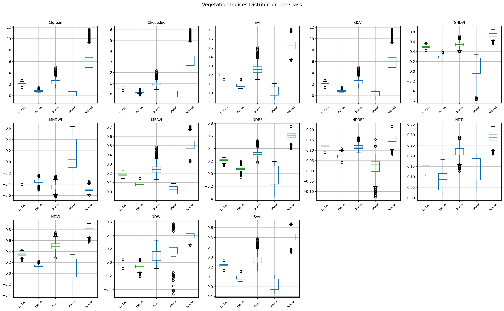
</p>

---

#### 1.5 Key Index Histograms by Class

Density histograms of 6 key indices (NDVI, EVI, NDWI, SAVI, MNDWI, BSI) overlaid by class. These reveal the degree of separability each index provides. NDVI and SAVI show clear bimodal patterns separating vegetated from non-vegetated classes. Water is distinctly separated by NDWI and MNDWI with values far from other classes.

<p align="center">
  
</p>

---

#### 1.6 Normalized Per-Class Feature Profiles

A grouped bar chart showing the normalized mean value of every feature for each class. This "spectral fingerprint" view highlights how each class has a unique profile across the 23 features. Wheat dominates in vegetation-sensitive features (NDVI, EVI, SAVI), Fallow peaks in bare-soil indicators (BSI, B11), and Water shows near-zero values across most features except MNDWI.

<p align="center">
  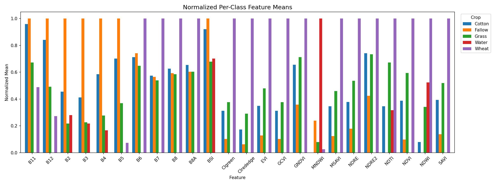
</p>

---

### 2. Model Training

#### 2.1 Training Loss and Validation Accuracy Curves

The training loss decreases rapidly in the first 10 epochs and converges near zero, indicating effective learning. Validation accuracy climbs from ~79% to ~99.9%, with early stopping triggered after epoch 55. The smooth convergence with no divergence between training and validation suggests the model generalizes well without overfitting.

<p align="center">
  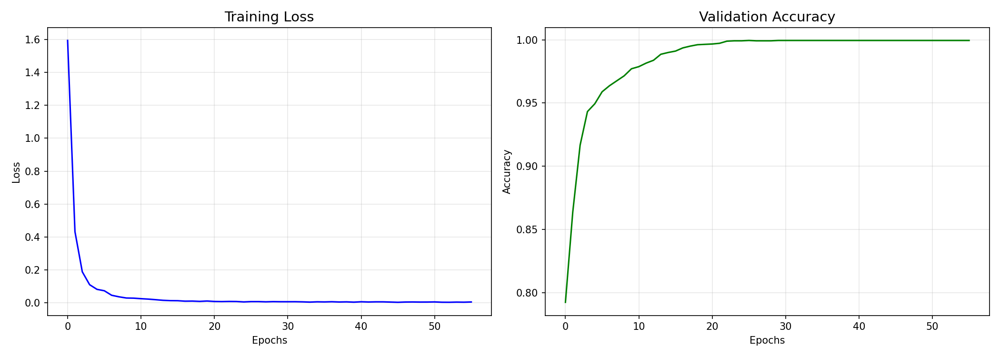
</p>

---

### 3. Model Evaluation

#### 3.1 Confusion Matrix (Test Set)

The confusion matrix on the held-out test set (15% of data) shows near-perfect classification. All 5 classes achieve close to 100% recall, with only 3 misclassified samples total (all from the Grass class: 1 predicted as Cotton, 2 as Wheat). Cotton (48 samples), Wheat (1149), Fallow (1619), and Water (21) are classified with zero errors.

<p align="center">
  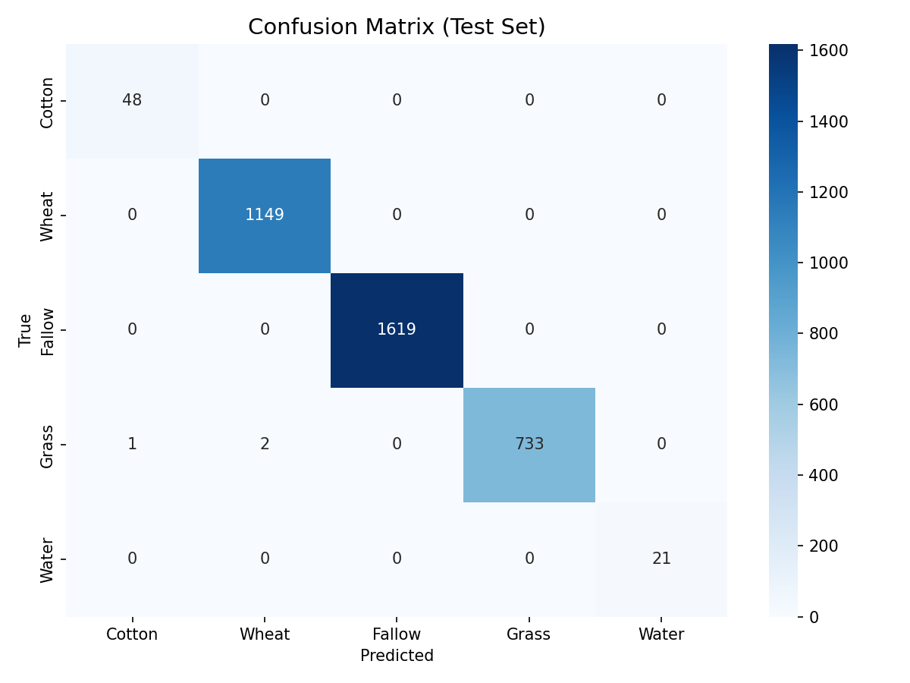
</p>

---

#### 3.2 Normalized Confusion Matrix (Test Set)

The row-normalized confusion matrix confirms all classes achieve >= 99.6% recall. Cotton, Wheat, Fallow, and Water reach a perfect 1.000, while Grass achieves 0.996. This demonstrates the GCN's ability to handle class imbalance effectively through weighted loss.

<p align="center">
  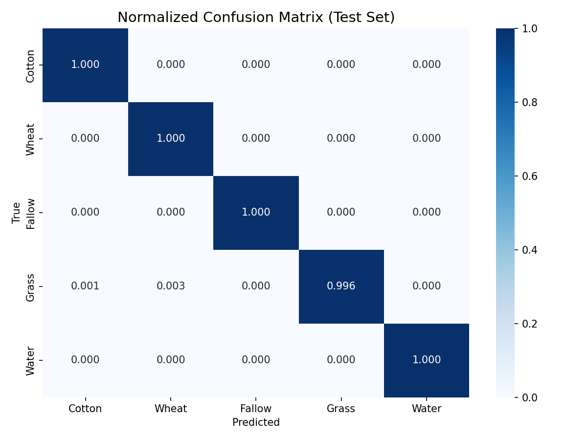
</p>

---

#### 3.3 Per-Class Accuracy

A bar chart summarizing per-class accuracy on the test set. All 5 classes exceed 99.6%, confirming consistently strong performance across both majority classes (Fallow, Wheat) and minority classes (Cotton, Water).

<p align="center">
  
</p>

---

#### 3.4 t-SNE Visualization of GCN Node Embeddings

A 2D t-SNE projection of the learned 128-dimensional node embeddings from the GCN's second-to-last layer. The 5 classes form well-separated clusters, confirming that the GCN learns discriminative feature representations. Cotton (blue) and Water (purple) form tight, isolated clusters, while the larger classes (Fallow, Wheat, Grass) occupy distinct regions with clear boundaries.

<p align="center">
  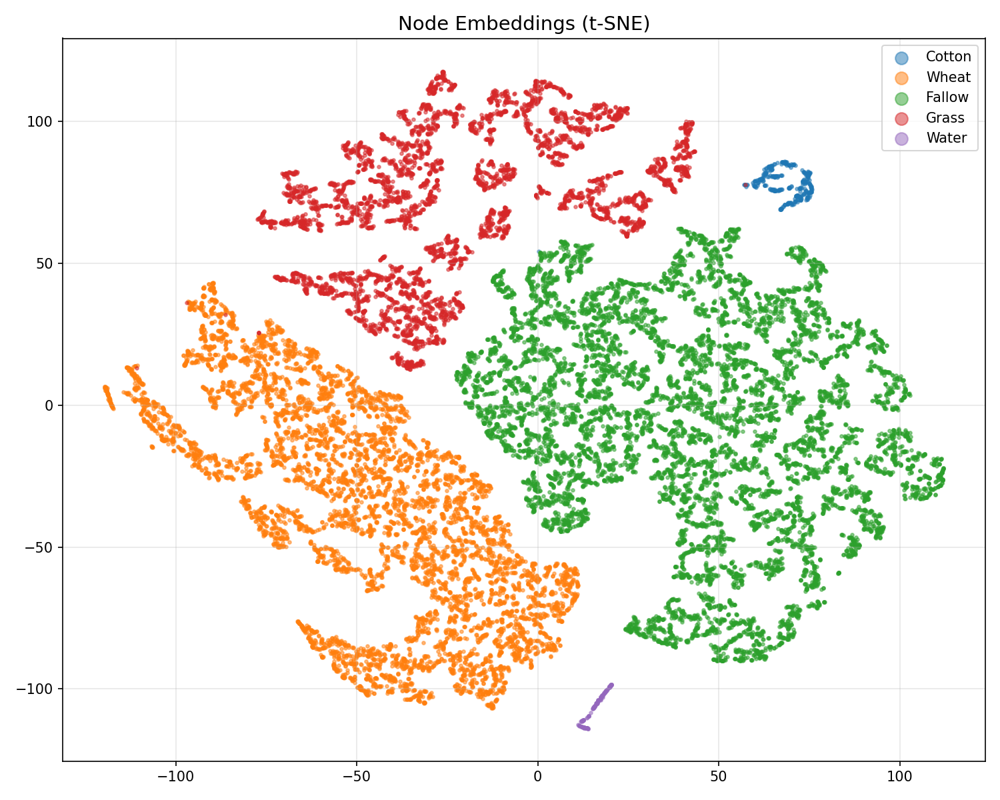
</p>

---

### 4. Spatial Classification Map

The final classified crop map produced by applying the trained GCN to the full Sentinel-2 raster (2262 x 1424 pixels, 10 m resolution). Over 1 million valid pixels were classified using tiled KNN-graph inference. Fallow (tan) dominates bare agricultural areas, Wheat (yellow) and Grass (green) cover vegetated parcels, Water (blue) aligns with river and canal features, and Cotton (red) appears in scattered agricultural plots.

| Class | Classified Pixels | Percentage |
|:------|------------------:|-----------:|
| **Fallow** | 697,687 | 66.8% |
| **Grass** | 163,758 | 15.7% |
| **Wheat** | 141,385 | 13.5% |
| **Cotton** | 29,329 | 2.8% |
| **Water** | 11,696 | 1.1% |

<p align="center">
  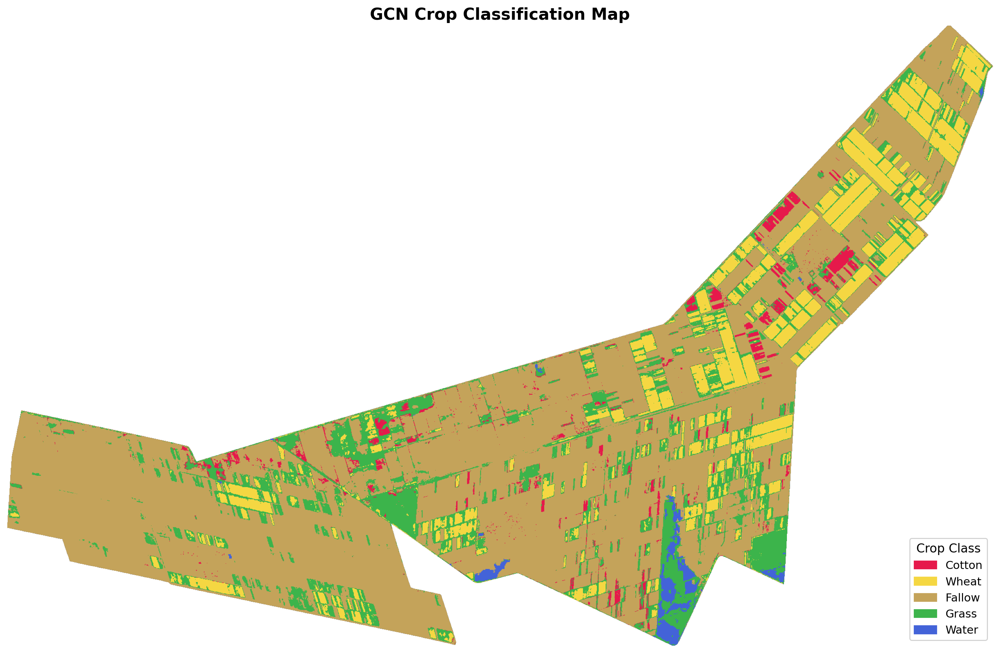
</p>

---

## Interactive Demo

An interactive Streamlit dashboard is included for exploring results, model performance, and data analysis -- no coding required.

```bash
pip install streamlit plotly pillow
streamlit run app.py
```

The dashboard features 4 tabs:

| Tab | Content |
|:----|:--------|
| **Classification Map** | Predicted crop map + pixel-count bar chart and donut chart |
| **Model Performance** | Training curves, confusion matrix, per-class accuracy, t-SNE embeddings |
| **Data Explorer** | Class distribution, correlation heatmap, index histograms, feature profiles |
| **Architecture** | GCN architecture diagram with model details |

---

## Installation

**Prerequisites:** Python 3.9+, CUDA-capable GPU (recommended)

```bash
# Create conda environment (recommended)
conda create -n geodl python=3.9
conda activate geodl

# Install PyTorch (adjust CUDA version as needed)
conda install pytorch torchvision pytorch-cuda=12.1 -c pytorch -c nvidia

# Install PyTorch Geometric
conda install pyg -c pyg

# Install remaining dependencies
conda install rasterio scikit-learn pandas matplotlib seaborn -c conda-forge
```

Or install from `requirements.txt` (PyTorch and PyG must be installed separately):

```bash
pip install -r requirements.txt
```

## Usage

### 1. Explore data

```bash
python explore_data.py
```

Generates EDA visualizations in `figures/`.

### 2. Train the GCN

```bash
python gcn_crop_classification.py
```

Trains the model with early stopping and saves `best_gcn_model.pth` along with evaluation plots.

### 3. Classify full raster

```bash
python apply_gcn_to_raster.py
```

Applies the trained GCN to the Sentinel-2 composite and produces:
- `data/crop_classification_map.tif` -- Classified GeoTIFF (same CRS/transform as input)
- `figures/crop_classification_map.png` -- Color-coded visualization

## Data

### Study Area

The study area is located in the **Gezira agricultural region, Sudan** -- one of the largest irrigated schemes in Africa, situated between the Blue Nile and White Nile rivers.

| Property | Value |
|:---------|:------|
| **Location** | Gezira State, Sudan |
| **Center coordinates** | 14.053° N, 32.623° E |
| **Coordinate system** | WGS 84 / UTM Zone 36N (EPSG:32636) |
| **Spatial extent** | 22.62 km x 14.24 km (322 km²) |
| **Temporal period** | Q1 2020 (January -- March) |
| **Satellite** | Sentinel-2 (ESA Copernicus) |

---

### Sentinel-2 Raster Composite

The input raster is a multi-temporal composite derived from Sentinel-2 Level-2A (surface reflectance) imagery.

`S2_composite_24bands_2020_Q1.tif`

| Property | Value |
|:---------|:------|
| **Dimensions** | 2,262 x 1,424 pixels |
| **Total pixels** | 3,221,088 |
| **Valid pixels** | 1,043,855 (32.4%) |
| **Spatial resolution** | 10 m |
| **Bands** | 24 (float32) |
| **Compression** | LZW |
| **File size** | ~107 MB |

#### Spectral Bands (10)

Sentinel-2 surface reflectance bands covering visible, red-edge, near-infrared, and short-wave infrared wavelengths:

| Band | Name | Wavelength (nm) | Description |
|:-----|:-----|:---------------:|:------------|
| 1 | **B2** | 490 | Blue |
| 2 | **B3** | 560 | Green |
| 3 | **B4** | 665 | Red |
| 4 | **B5** | 705 | Red Edge 1 |
| 5 | **B6** | 740 | Red Edge 2 |
| 6 | **B7** | 783 | Red Edge 3 |
| 7 | **B8** | 842 | Near Infrared (NIR) |
| 8 | **B8A** | 865 | Narrow NIR |
| 9 | **B11** | 1610 | Short-Wave Infrared 1 (SWIR-1) |
| 10 | **B12** | 2190 | Short-Wave Infrared 2 (SWIR-2) |

#### Spectral Indices (14)

Derived vegetation, water, and soil indices computed from the spectral bands:

| Index | Formula | Purpose |
|:------|:--------|:--------|
| **NDVI** | (NIR - Red) / (NIR + Red) | Vegetation greenness |
| **EVI** | 2.5 * (NIR - Red) / (NIR + 6*Red - 7.5*Blue + 1) | Enhanced vegetation (corrects atmospheric effects) |
| **SAVI** | 1.5 * (NIR - Red) / (NIR + Red + 0.5) | Soil-adjusted vegetation |
| **GNDVI** | (NIR - Green) / (NIR + Green) | Green-band vegetation |
| **NDRE** | (NIR - RedEdge1) / (NIR + RedEdge1) | Red-edge vegetation |
| **NDRE2** | (RedEdge3 - RedEdge1) / (RedEdge3 + RedEdge1) | Narrow red-edge vegetation |
| **NDWI** | (Green - NIR) / (Green + NIR) | Water content in vegetation |
| **MNDWI** | (Green - SWIR1) / (Green + SWIR1) | Modified water index (surface water) |
| **BSI** | ((SWIR1 + Red) - (NIR + Blue)) / ((SWIR1 + Red) + (NIR + Blue)) | Bare soil |
| **NDTI** | (SWIR1 - SWIR2) / (SWIR1 + SWIR2) | Non-photosynthetic vegetation / tillage |
| **CIgreen** | (NIR / Green) - 1 | Chlorophyll index (green) |
| **CIrededge** | (NIR / RedEdge1) - 1 | Chlorophyll index (red edge) |
| **MSAVI** | (2*NIR + 1 - sqrt((2*NIR+1)² - 8*(NIR-Red))) / 2 | Modified soil-adjusted vegetation |
| **GCVI** | (NIR / Green) - 1 | Green chlorophyll vegetation index |

> **Note:** GCVI is identical to CIgreen and is dropped during training, leaving **23 features**.

---

### Training Dataset

Labeled ground-truth samples extracted from the raster at known crop field locations.

`crop_training_data_5classes_2020.csv`

| Property | Value |
|:---------|:------|
| **Total samples** | 24,556 |
| **After deduplication** | 24,556 (no duplicates) |
| **Features** | 23 (after dropping GCVI) |
| **Missing values** | 0 |
| **File size** | ~8.6 MB |

#### Class Distribution

| Class ID | Class Name | Samples | Percentage | Category |
|:--------:|:-----------|--------:|:----------:|:---------|
| 0 | **Cotton** | 337 | 1.4% | Minority |
| 1 | **Wheat** | 7,901 | 32.2% | Majority |
| 2 | **Fallow** | 11,150 | 45.4% | Majority |
| 3 | **Grass** | 5,024 | 20.5% | Moderate |
| 4 | **Water** | 144 | 0.6% | Minority |

#### Data Split

The dataset is split using stratified random sampling (seed=42) to preserve class proportions:

| Split | Percentage | Samples | Purpose |
|:------|:----------:|--------:|:--------|
| **Train** | 70% | 17,189 | Model training + scaler fitting |
| **Validation** | 15% | 3,684 | Early stopping & hyperparameter selection |
| **Test** | 15% | 3,683 | Final unbiased evaluation |

#### Feature Value Ranges

| Feature | Min | Max | Mean | Std |
|:--------|----:|----:|-----:|----:|
| B2 | 0.0124 | 0.1406 | 0.0567 | 0.0321 |
| B3 | 0.0336 | 0.1806 | 0.0912 | 0.0378 |
| B4 | 0.0179 | 0.2885 | 0.1053 | 0.0682 |
| B5 | 0.0379 | 0.3036 | 0.1490 | 0.0649 |
| B6 | 0.0152 | 0.3286 | 0.1973 | 0.0792 |
| B7 | 0.0187 | 0.3856 | 0.2172 | 0.0906 |
| B8 | 0.0211 | 0.4196 | 0.2320 | 0.0989 |
| B8A | 0.0173 | 0.3943 | 0.2366 | 0.0945 |
| B11 | 0.0276 | 0.3987 | 0.2073 | 0.0641 |
| B12 | 0.0223 | 0.3001 | 0.1526 | 0.0660 |
| NDVI | -0.3794 | 0.9099 | 0.4226 | 0.2892 |
| EVI | -0.1346 | 0.7345 | 0.1951 | 0.1741 |
| SAVI | -0.0748 | 0.6408 | 0.2633 | 0.1842 |
| GNDVI | -0.1824 | 0.8117 | 0.4384 | 0.2215 |
| NDRE | -0.1618 | 0.4439 | 0.1583 | 0.1397 |
| NDRE2 | -0.1485 | 0.2174 | 0.0792 | 0.0733 |
| NDWI | -0.4701 | 0.5739 | 0.1183 | 0.2075 |
| MNDWI | -0.6554 | 0.3752 | -0.3611 | 0.1686 |
| BSI | -0.4143 | 0.2164 | -0.0017 | 0.1064 |
| NDTI | 0.0034 | 0.2614 | 0.1193 | 0.0414 |
| CIgreen | -0.2674 | 11.6385 | 2.0076 | 2.0345 |
| CIrededge | -0.2386 | 3.8363 | 0.5632 | 0.5991 |
| MSAVI | -0.1033 | 0.5920 | 0.1676 | 0.1568 |

---

### Preprocessing Pipeline

```
Raw CSV (24,556 samples, 28 columns)
        |
        v
Drop metadata columns (system:index, .geo)
        |
        v
Drop GCVI (duplicate of CIgreen)
        |
        v
Remove duplicates (0 found)
        |
        v
Stratified train/val/test split (70/15/15)
        |
        v
StandardScaler (fit on train set only)
        |
        v
KNN Graph Construction (k=8 neighbors)
        |
        v
PyTorch Geometric Data Object
```

## License

This project is licensed under the [MIT License](LICENSE).
